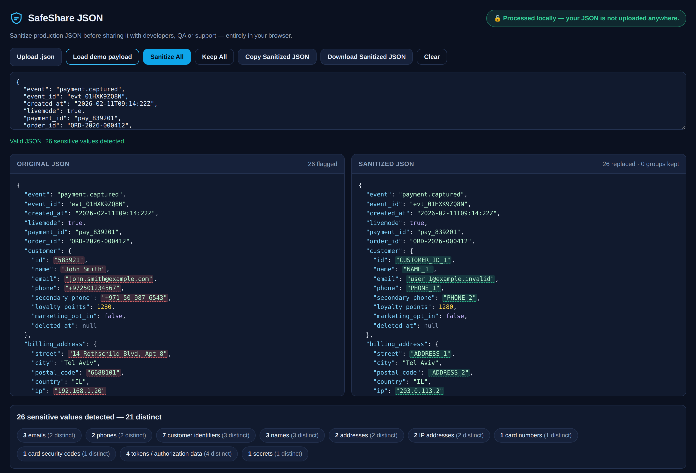
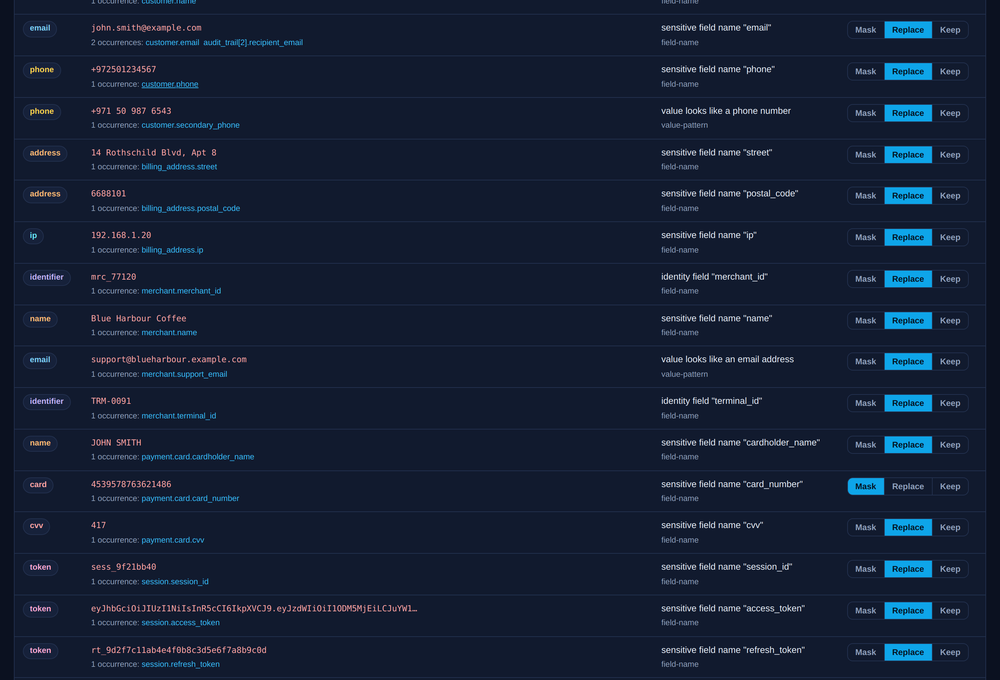
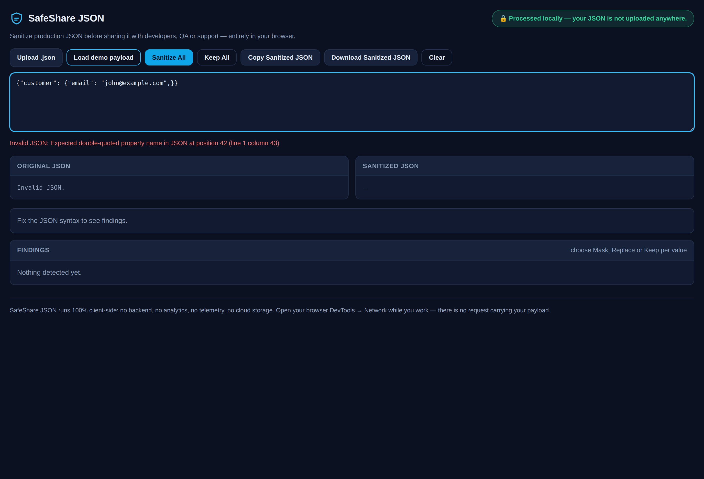

# SafeShare JSON

Sanitize production JSON before sharing it with developers, QA or support — entirely in your browser.

[](https://github.com/VsevaTech/safeshare-json/actions/workflows/ci.yml)
[](https://vsevatech.github.io/safeshare-json/)
[](LICENSE)

**Live demo → https://vsevatech.github.io/safeshare-json/**

Sharing a real payload with a colleague normally means one of two bad options: send it as-is
(and leak customer data), or clean it by hand (slow, and you *will* miss a field five levels
down). SafeShare JSON turns a production-like payload into a copy that is safe to paste into a
ticket, a chat or a bug report — while keeping the structure and the links between values, so
the payload is still usable for debugging.

```text
paste/upload JSON → detect → review → Mask / Replace / Keep → copy or download
```

🔒 **Processed locally — your JSON is not uploaded anywhere.** There is no backend, no analytics,
no telemetry, no remote logging and no external AI API. Open DevTools → Network while you use it:
after the page has loaded there is not a single request.

---

## Screenshots

| Side-by-side sanitization |
| --- |
|  |

| Findings, with per-value Mask / Replace / Keep |
| --- |
|  |

| Inline JSON validation |
| --- |
|  |

The screenshots are regenerated from the real application by the
[`Screenshots`](.github/workflows/screenshots.yml) workflow, which fails if the app performs any
network request after load.

---

## Why the sanitized payload is still useful

The replacement is computed **once per (category, value)** and reused everywhere that value
appears, so relationships inside the document survive:

```json
{
  "customer_id": "583921",
  "order": { "customer_id": "583921" }
}
```

becomes

```json
{
  "customer_id": "CUSTOMER_ID_1",
  "order": { "customer_id": "CUSTOMER_ID_1" }
}
```

Two different customers stay two different customers (`CUSTOMER_ID_1` / `CUSTOMER_ID_2`), and
running the same document through SafeShare twice produces byte-identical output.

Business fields are deliberately left alone: `amount`, `currency`, `status`, `payment_id`,
`order_id`, `request_id`, `trace_id`, booleans, nulls and numbers are never touched.

---

## Privacy model

| Property | How it is guaranteed |
| --- | --- |
| No backend | The app is a static bundle: HTML + one JS file + one CSS file. |
| No analytics / telemetry / remote logging | No third-party script, no external origin in the bundle. |
| No external AI API | Detection is regex + Luhn, running in your tab. |
| No cloud storage | The document lives in one module-level variable. |
| Nothing survives a refresh | `localStorage`, `sessionStorage`, IndexedDB and cookies are never used. |
| Uploads stay local | `.json` files are read with `FileReader`; downloads use a local `Blob` URL. |

Two independent checks enforce this in CI:

* [`scripts/check-no-network.mjs`](scripts/check-no-network.mjs) greps the **production bundle**
  for `fetch`, `XMLHttpRequest`, `WebSocket`, `sendBeacon`, `EventSource`, `localStorage`,
  `sessionStorage`, `indexedDB`, `document.cookie` and any absolute external URL, and fails the
  build if one appears. (Vite's `modulePreload` polyfill is disabled for exactly this reason.)
* [`scripts/screenshots.mjs`](scripts/screenshots.mjs) drives the built app in a real Chromium,
  loads the demo payload, and fails if a single request is issued after page load or if any
  storage key is written.

You can reproduce the check yourself: load the app, open DevTools → Network, clear it, then paste
a payload and click *Sanitize All*. The request list stays empty.

---

## Detection rules

### By field name

Matching is case-insensitive and ignores separators, so `access_token`, `accessToken` and
`Access-Token` are the same field.

| Category | Field names |
| --- | --- |
| `secret` | `password`, `passwd`, `pwd`, `secret`, `client_secret`, `api_key`, `api_secret`, `private_key`, `signature`, `pin` |
| `token` | `token`, `access_token`, `refresh_token`, `id_token`, `authorization`, `auth`, `auth_token`, `bearer`, `jwt`, `session_id`, `cookie` |
| `email` | `email`, `email_address`, `mail`, `user_email`, `contact_email` |
| `phone` | `phone`, `phone_number`, `mobile`, `mobile_phone`, `msisdn`, `tel`, `telephone` |
| `name` | `name`, `first_name`, `last_name`, `full_name`, `middle_name`, `surname`, `given_name`, `family_name`, `cardholder_name` |
| `address` | `address`, `address_line1/2`, `street`, `billing_address`, `shipping_address`, `postal_code`, `zip` |
| `ip` | `ip`, `ip_address`, `client_ip`, `remote_ip`, `remote_addr` |
| `card` | `card_number`, `pan`, `card`, `card_no`, `account_number`, `iban` |
| `cvv` | `cvv`, `cvc`, `cvv2`, `csc`, `security_code` |
| `identifier` | `customer_id`, `client_id`, `merchant_id`, `user_id`, `account_id`, `buyer_id`, `payer_id`, `terminal_id`, `device_id`, `tax_id`, … and a bare `id` directly inside `customer`, `merchant`, `user`, `account`, … |

Explicitly **not** identifiers: `payment_id`, `order_id`, `transaction_id`, `invoice_id`,
`request_id`, `trace_id`, `correlation_id`, `event_id`, `subscription_id` — support and QA need
those to find the record.

### By value

Value scanning is deliberately conservative — a false positive costs a click, but a mangled
business field costs a debugging session.

| Category | Rule |
| --- | --- |
| `email` | `local@domain.tld` |
| `ip` | IPv4 with every octet in `0..255`; skipped for version-like fields |
| `token` | JWT (`ey…` + three dot-separated base64url segments) |
| `token` | `Bearer` / `Basic` / `Token` + a credential |
| `card` | 13–19 digits (spaces and dashes ignored) **that pass the Luhn checksum** |
| `phone` | 8–15 digits **and** a `+` prefix, or grouping separators, or a 9–11 digit national form starting with `0` |

A 13-digit acquirer reference such as `9921004573310` fails Luhn, has no `+` and no separators —
so it is left untouched, while `4539 5787 6362 1486` is recognised as a PAN.

The field name always wins over the value: `"phone": "0000000000"` is still a phone field.

### Actions

| Action | Result |
| --- | --- |
| **Replace** | Deterministic pseudonym: `user_1@example.invalid`, `PHONE_1`, `CUSTOMER_ID_1`, `NAME_1`, `ADDRESS_1`, `203.0.113.1` (RFC 5737 TEST-NET-3), `[REDACTED_TOKEN]`, `[REDACTED_SECRET]` |
| **Mask** | Character-level: `j***@e******.com`, `************1486` (last four digits kept), `+97********67`, `192.168.*.*` |
| **Keep** | Left exactly as it was |

Defaults: everything is replaced, except card numbers, which are masked so the last four digits
stay available for support. `Sanitize All` resets every finding to its default; `Keep All` does
the opposite.

---

## Limitations

* **Detection is heuristic, not a guarantee.** Free-text fields (`comment`, `description`,
  `notes`) can contain personal data that no field-name or regex rule will catch. Always skim the
  findings list before sharing — that is why the review step exists.
* Only names and values are inspected; **object keys are never rewritten**, so a key such as
  `john@example.com` inside a map would survive.
* Replaced values are always strings. A numeric `customer_id: 583921` becomes
  `"CUSTOMER_ID_1"`, which changes the JSON type of that field.
* Phone detection only covers the shapes listed above; exotic national formats without `+` or
  separators are not recognised by value (they are still caught by field name).
* No IPv6, no MAC address, no passport/IBAN checksum validation yet.
* Very large documents (tens of MB) are re-rendered on every keystroke and will feel slow; the
  work is still done entirely in your tab.
* The tool reduces risk; it does not make a payload compliant with PCI DSS, GDPR or any other
  standard on its own.

---

## Local development

Requires Node.js 20+.

```bash
git clone https://github.com/VsevaTech/safeshare-json.git
cd safeshare-json
npm install
npm run dev          # http://localhost:5173/safeshare-json/
```

### Tests

```bash
npm test             # Vitest, 61 unit tests
npm run test:watch
```

The suite covers nested objects, arrays, root-level arrays, 40-level nesting, invalid JSON,
every detector, valid and invalid Luhn numbers, null/boolean/number preservation, immutability of
the input document, and the critical guarantee: *the same sensitive value in five locations is
replaced by the same placeholder in all five*.

### Lint and type check

```bash
npm run lint
npx tsc --noEmit
```

### Build

```bash
npm run build        # -> dist/ (static, deployable anywhere)
npm run preview
node scripts/check-no-network.mjs
```

The bundle is served from `/safeshare-json/` by default so it works on GitHub Pages. For another
host, build with a different base:

```bash
SAFESHARE_BASE=/ npm run build
```

---

## Project layout

```text
src/core/      pure, DOM-free detection and sanitization engine
src/ui/        browser UI (vanilla TypeScript, no framework)
tests/         Vitest suite
examples/      synthetic payment payload used by the demo button
scripts/       CI privacy guard and screenshot generator
public/        static assets copied verbatim into the build
```

`src/core` has no dependency on the DOM, the network or any storage API — which is what makes the
privacy promise testable rather than aspirational.

## Stack

TypeScript · Vite · Vitest · ESLint · zero runtime dependencies.

## License

[MIT](LICENSE)
